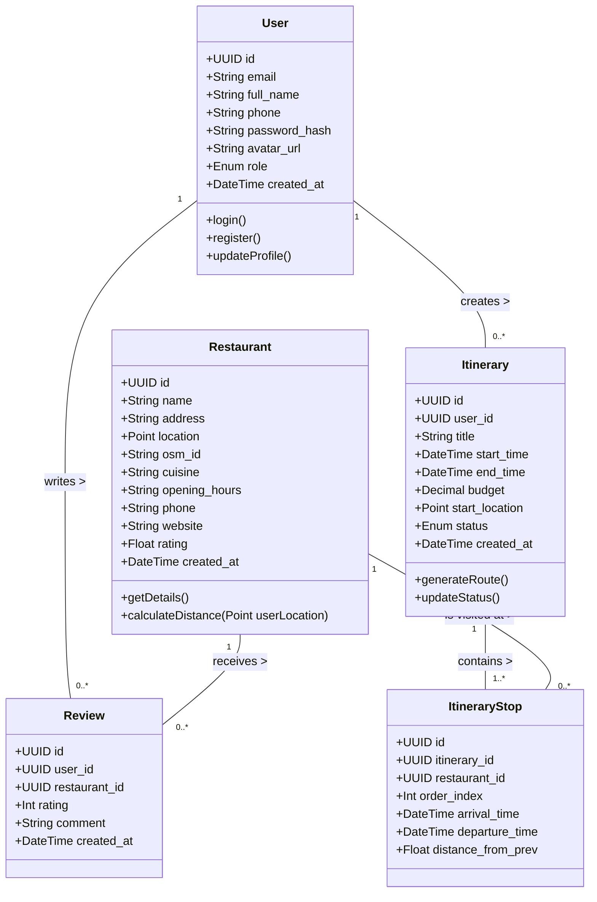

# Sơ đồ Lớp (Class Diagram) - GastroWise

Tài liệu này mô tả cấu trúc dữ liệu và mối quan hệ giữa các đối tượng chính trong hệ thống **GastroWise**. Bạn có thể sao chép hình ảnh hoặc đoạn code Mermaid này vào báo cáo KLTN.

## 1. Sơ đồ UML (Mermaid)

## 2. Giải thích các Thực thể (Entities)

- **User**: Lưu trữ thông tin người dùng. Có vai trò (role) để phân quyền (Admin/User).
- **Restaurant**: Chứa dữ liệu của quán ăn/nhà hàng. Đặc biệt có thuộc tính `location` kiểu `Point` (PostGIS) để phục vụ cho việc tính toán khoảng cách và tìm kiếm xung quanh (thuật toán không gian). `osm_id` dùng để đối chiếu với dữ liệu gốc OpenStreetMap.
- **Review**: Đánh giá của người dùng đối với một nhà hàng. Cung cấp dữ liệu để hệ thống tính toán Rating trung bình cho nhà hàng.
- **Itinerary**: Lộ trình ăn uống được thuật toán đề xuất hoặc người dùng tự tạo. Lưu cấu hình đầu vào (thời gian, ngân sách, điểm bắt đầu).
- **ItineraryStop**: Các điểm dừng cụ thể trong một lộ trình. Liên kết trực tiếp một lộ trình với một nhà hàng theo thứ tự (`order_index`) và thời gian cụ thể.

Tương lai hệ thống có thể mở rộng thêm các lớp `Menu`, `MenuItem` nếu cần lấy chi tiết món ăn.
