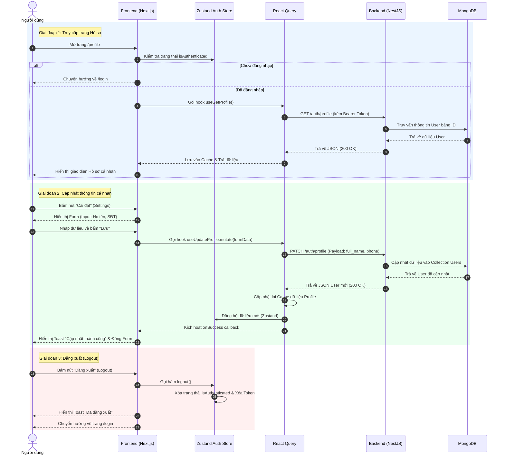

# Luồng Sự Kiện Trang Hồ Sơ Người Dùng (User Profile Flow)

Tài liệu này mô tả chi tiết luồng hoạt động (Event Flow) của trang Hồ Sơ Người Dùng trong ứng dụng GastroWise, phục vụ cho việc đính kèm vào báo cáo Khóa Luận Tốt Nghiệp (KLTN).

## 1. Giới thiệu chức năng

Trang Hồ sơ cá nhân (Profile Page) cho phép người dùng:
1. **Xem thông tin**: Hiển thị họ tên, email, số điện thoại, và các thống kê liên quan đến ứng dụng (số km tiết kiệm, chi tiêu, lộ trình).
2. **Cập nhật thông tin**: Chỉnh sửa họ tên, số điện thoại thông qua Form cập nhật.
3. **Đăng xuất**: Hủy bỏ phiên đăng nhập và xóa token lưu trữ.

## 2. Sơ đồ Luồng Hoạt Động (Sequence Diagram)

Dưới đây là sơ đồ Mermaid mô tả tương tác giữa Người dùng (Client), Trình duyệt (Frontend), và Máy chủ (Backend NestJS) khi thực hiện các chức năng trên trang.

## 3. Kiến trúc State Management

- **Zustand (`useAuthStore`)**: Quản lý trạng thái đăng nhập toàn cục (`isAuthenticated`) và chứa một bản sao thông tin thiết yếu của User (để hiển thị trên Header, Navbar...).
- **React Query (`useGetProfile`, `useUpdateProfile`)**: Quản lý việc gọi API, lưu cache (caching), trạng thái tải (isLoading) và cập nhật dữ liệu tự động mà không cần refresh trang. Khi gọi API `PATCH` thành công, React Query sẽ tự động ghi đè bản cache cũ và báo cho Zustand cập nhật.

## 4. Ghi chú cho Báo cáo

Bạn có thể copy đoạn mã `mermaid` trên và dán vào các công cụ hỗ trợ như [Mermaid Live Editor](https://mermaid.live/) hoặc chèn trực tiếp vào các file Markdown có hỗ trợ (như GitHub, Notion, Obsidian) để nó tự render ra thành hình ảnh biểu đồ.
